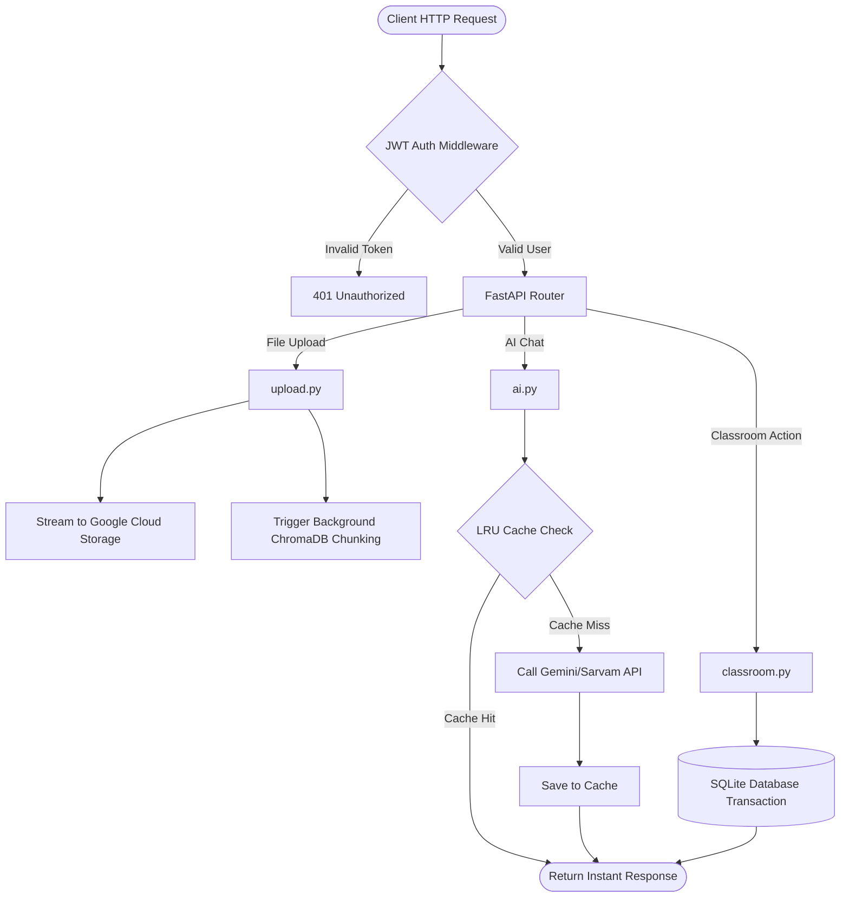

# ⚙️ Backend API Architecture

The OmniOS backend is a high-throughput RESTful API built on **FastAPI (Python)**. It acts as the central brain orchestrating database transactions, AI API calls, vector chunking, and file storage.

## 1. API Request Lifecycle (Flowchart)

## 2. Modular Routing Structure

The application is strictly modularized within `app/routes/` to enforce clean code practices:
*   `auth.py`: JWT login, registration, and user validation.
*   `upload.py`: Handles file uploads (multipart form data), interacts with GCS, and queues background RAG chunking tasks.
*   `ai.py`: Exposes `/api/ai/chat`. Handles Vector DB retrieval, the API Cache, and Gemini/Sarvam inference.
*   `classroom.py`: CRUD operations for virtual classrooms and student enrollments.
*   `analytics.py`: Manages the zero-load daily streak system.

## 3. API Caching System (Rate Limit Bypass)

To prevent Google Gemini's "Too Many Requests" (429) errors, a custom Memory-based LRU Cache is injected directly into `ai.py`.

### How it works:
1.  **Hash Generation:** The backend combines the student's question and the retrieved RAG context into a single string, then applies `hashlib.md5()`.
2.  **Lookup:** If this hash exists in memory, the API returns the cached answer instantly (`0.01s`).
3.  **Execution:** If it's a cache miss, the backend calls the expensive Gemini API, returns the answer, and stores it in the cache for future students.

## 4. Storage Layer: Google Cloud Storage (GCS)

Local disk storage is a bottleneck for scaling. The backend uses `google-cloud-storage` for infinite scalability.

*   **Logic (`app/utils/gcs.py`):**
    If `.env` has `USE_GCS=True`, `upload.py` streams the uploaded PDF bytes directly to a GCS bucket.
*   **Database Record:** The `file_path` column in the database stores the public URL.
*   **Graceful Fallback:** If GCS credentials fail or are missing, the backend catches the exception and falls back to writing the file locally to `uploads/documents/`.
