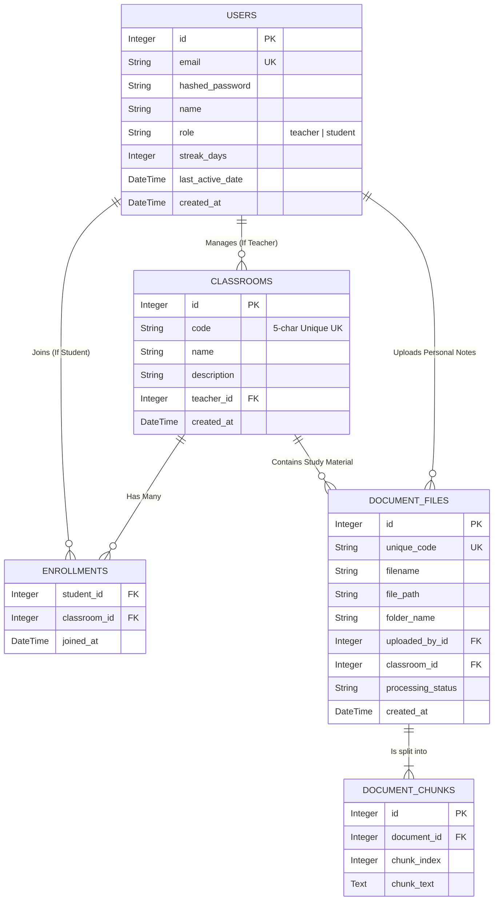

# 🗄️ ER Diagram & Database Schema

OmniOS uses a robust relational database (managed by SQLAlchemy) to handle user accounts, classroom logic, and document metadata.

## 1. Database Transaction Lifecycle (Flowchart)

```mermaid
flowchart TD
    Req([API Request Received]) --> Session[Get DB Session `Depends(get_db)`]
    Session --> Query[Execute SQLAlchemy ORM Query]
    Query --> Validation{Is Data Valid?}
    
    Validation -->|Yes| Commit[db.commit()]
    Validation -->|No| Rollback[db.rollback()]
    
    Commit --> Refresh[db.refresh(model)]
    Refresh --> Close[db.close() via Yield]
    Rollback --> Error[Raise HTTPException]
    Error --> Close
```

## 2. Entity-Relationship (ER) Diagram



## 3. Table Definitions

### `users` Table
Handles authentication, profiles, and the zero-load streak system.
*   **`email`**: Unique identifier for login.
*   **`role`**: Enforces permissions. Teachers can create classes; Students can only join.
*   **`streak_days` / `last_active_date`**: Used to calculate daily academic engagement without background chron jobs.

### `classrooms` & `enrollments` Tables
*   **Classrooms** are strictly owned by one teacher (`teacher_id`).
*   **Enrollments** act as a junction/mapping table connecting many students to many classrooms.

### `document_files` Table
Stores metadata for all PDFs.
*   **`file_path`**: The most critical column. Can store a local server path (`uploads/documents/...`) OR a Google Cloud Storage (GCS) Public URL. The backend dynamically serves the file based on this prefix.
*   **`classroom_id`**: If NULL, the document is a "Personal Note". If populated, it is "Classroom Study Material" visible to all enrolled students.
