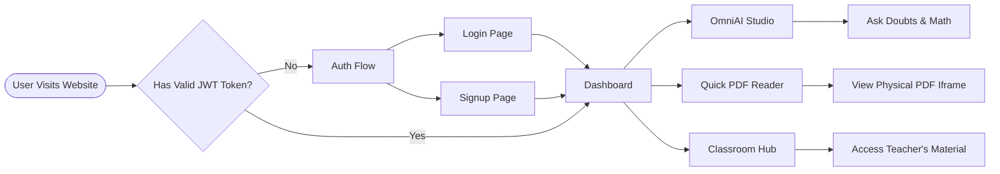
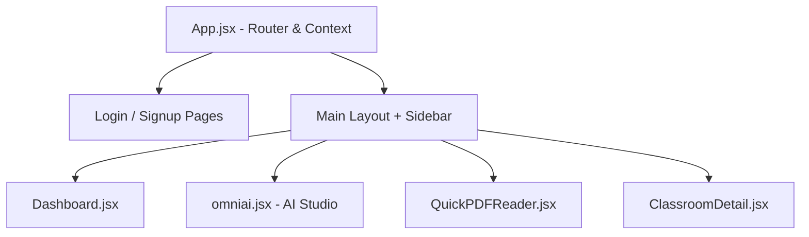

# 🎨 Frontend UI Architecture

The OmniOS frontend is a Single Page Application (SPA) built for extreme fluidity, aesthetic appeal, and zero lag.

## 1. User Navigation Flow (Flowchart)

## 2. Core Tech Stack
*   **React.js (via Vite):** For component-based UI and lightning-fast hot module replacement.
*   **Tailwind CSS:** Used exclusively for all styling, ensuring minimal CSS bundle size.
*   **React Router DOM:** For client-side routing (`/dashboard`, `/omniai`, `/quick-reader`).
*   **Axios:** Configured with interceptors to automatically attach JWT tokens (via HTTP-Only cookies or headers) to every API request.

## 3. Component Hierarchy

## 4. Performance Engineering (The Canvas Fix)

One of the biggest architectural wins in the frontend is the stabilization of the HTML5 Canvas backgrounds (e.g., `WaterWaveCanvas`, `ThreadFabricCanvas`).

### The Problem:
Standard canvas animations running at 60FPS constantly reallocate memory (`ctx.createImageData`), causing massive Garbage Collection (GC) spikes, leading to lag and UI stuttering across the whole app.

### The Solution:
1.  **Zero-Allocation Loop:** Buffers and typed arrays (`Uint8ClampedArray`) are initialized *exactly once* during the `handleResize` event. The 60FPS `requestAnimationFrame` loop mutates existing memory instead of creating new objects.
2.  **Visibility API Pause:** The canvas hooks into `document.visibilityState`. If the user switches browser tabs, the animation loop is completely halted, dropping CPU usage to 0%.
3.  **Graceful Decay:** In `WaterWaveCanvas`, an exponential decay algorithm automatically calms the water 10 seconds after the user stops moving the mouse, saving rendering power.

## 5. UI/UX Decisions
*   **Real PDF Viewer:** Instead of rendering extracted text (which ruins formatting and images), the app serves the physical PDF directly from the backend (`/api/upload/raw/{doc_id}`) into an `<iframe>`, preserving the exact visual integrity of the original document.
*   **Unclickable Branding:** The OmniOS logo inside the sidebar is wrapped in `pointer-events-none` to prevent accidental clicks.
