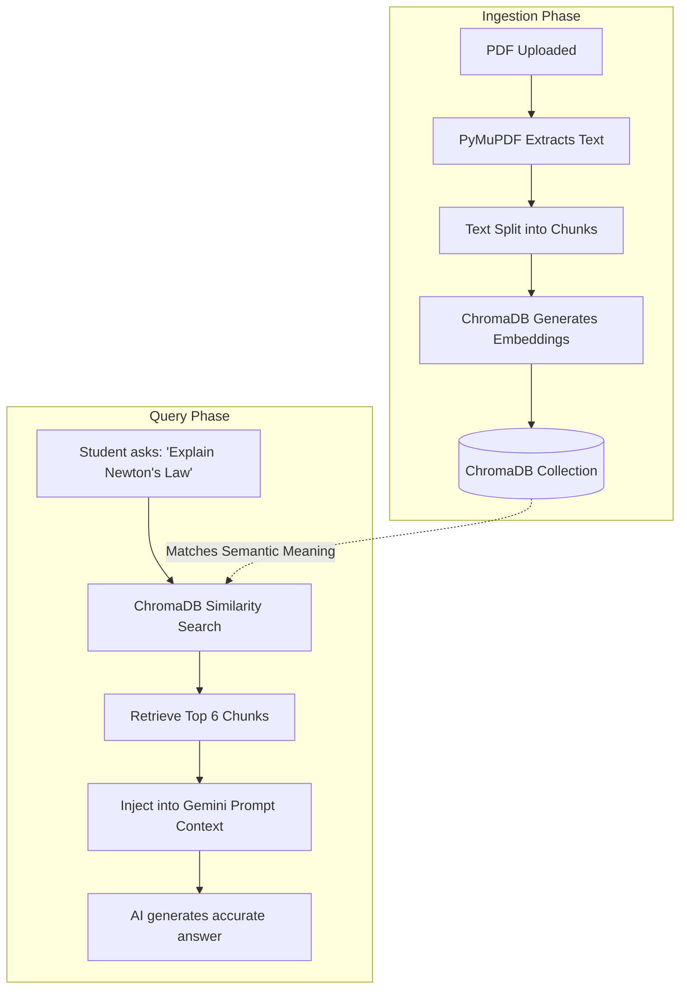

# 🧠 Vector Database & RAG Pipeline

OmniOS utilizes **ChromaDB** as its Vector Database to power the OmniAI Studio. This enables the AI to "read" hundreds of pages instantly and provide precise answers with source citations.

## 1. RAG (Retrieval-Augmented Generation) Flow



## 2. ChromaDB Configuration

### Collection Setup
All documents are stored in a unified ChromaDB collection. To ensure data privacy, **Metadata Filtering** is heavily utilized.
When a chunk is saved to ChromaDB, it includes the following metadata:
```json
{
  "document_id": 105,
  "classroom_id": 12,  // Null if personal note
  "uploaded_by_id": 4, // The teacher or student who owns it
  "filename": "Physics_Chapter_1.pdf"
}
```

### Security & Context Isolation
When a student asks a question in OmniAI Studio:
1.  The backend looks up all `classroom_ids` the student is enrolled in.
2.  The Vector Search query includes a strict `where` clause:
    ```python
    where={"$or": [
        {"uploaded_by_id": student.id},       # Personal Notes
        {"classroom_id": {"$in": my_classes}} # Classroom Material
    ]}
    ```
3.  **Result:** The AI can *never* hallucinate or leak information from another teacher's private classroom or another student's personal notes.

## 3. Embedding Model
Currently, ChromaDB uses its default lightweight embedding model (e.g., `all-MiniLM-L6-v2`) to convert text into mathematical vectors. This allows for lightning-fast semantic similarity searches running entirely on the local backend server without API costs.
